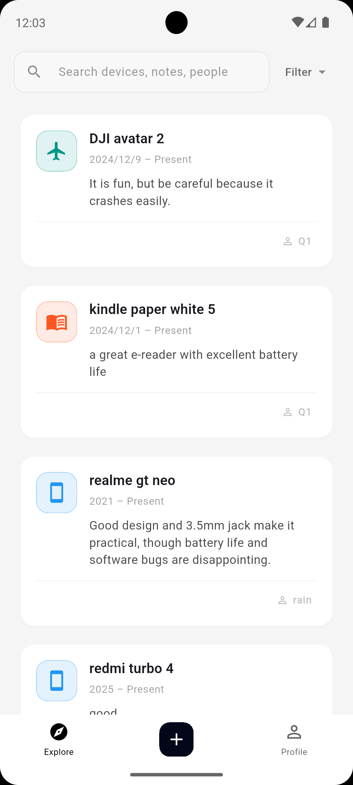
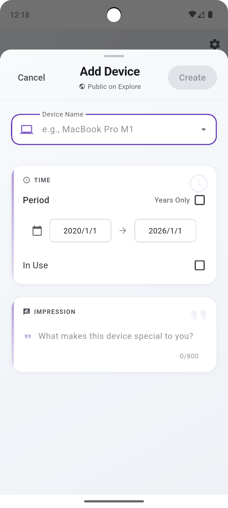
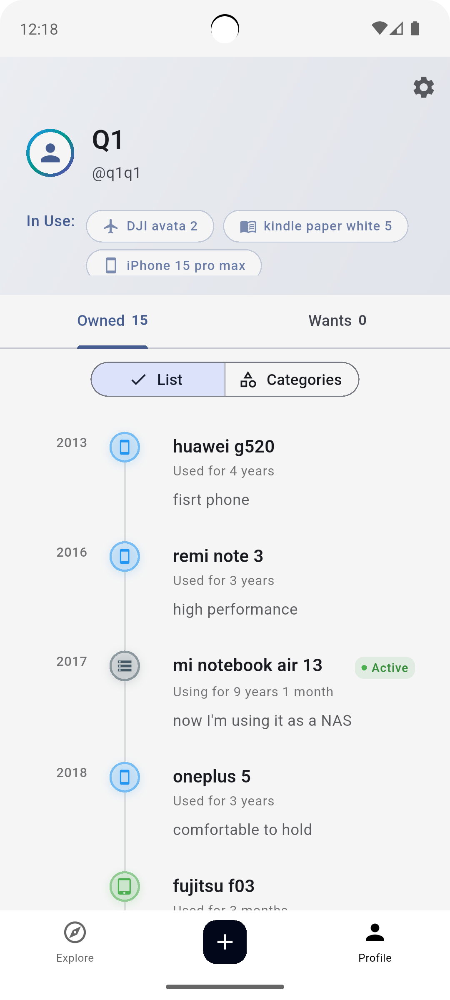
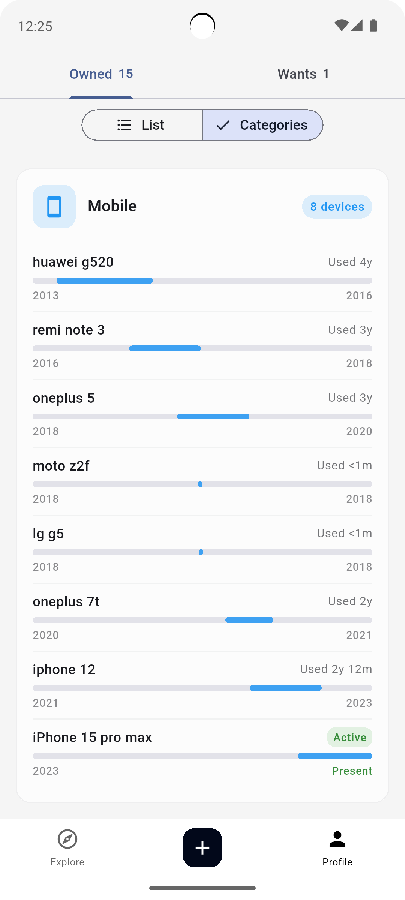
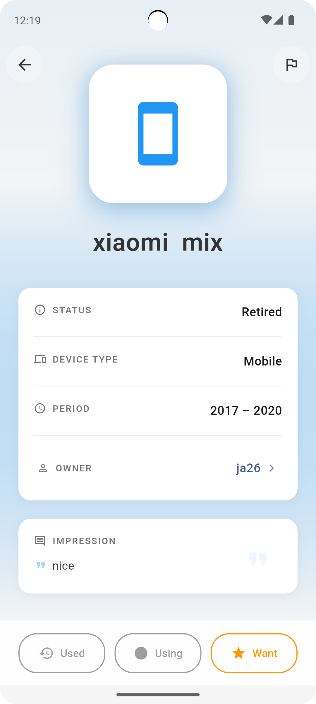

# Kien

Track your device ownership history and discover amazing devices from the community.

Kien is a social platform that helps you keep track of all the devices you've owned, create wishlists for devices you want, and explore what others in the community are using. Whether you're a tech enthusiast documenting your journey or someone looking for device recommendations, Kien makes it easy to organize and share your device collection.

## Features

### Device Tracking (Seki)
- Add devices with custom names and types
- Track ownership periods with precise dates or year ranges
- Add personal notes for each device
- Visual timeline representation of your device history
- Support for ongoing ownership (Present)

### Wishlist (Want)
- Create a wishlist of devices you want to own
- Organize by device type
- Quick access to your desired devices

### Social & Discovery
- Explore page to browse devices from all users
- Filter by device type
- Search functionality
- View other users' profiles and device collections
- User blocking and content moderation

### Data Management
- **Backup & Restore**: Export your collection to Excel for safekeeping
- **Import Data**: Restore your collection from exported files
- **Secure Storage**: Your data is safely stored in the cloud
- **Account Control**: Delete your account and data anytime

## Screenshots

  
  
  
  
  

## How to Use

### Getting Started

1. **Sign In**: Create an account using Google Sign-In or email authentication
2. **Add Your First Device**: Tap the "+" button to add a device you own or have owned
3. **Set Dates**: Choose between precise date tracking or year-based tracking
4. **Add Notes**: Include personal notes about your experience with each device
5. **Explore**: Browse devices from other users and discover new gadgets

### Managing Your Collection

- **Add Devices**: Easily add new devices with custom names and types
- **Edit Entries**: Update device information, dates, or notes anytime
- **Export Data**: Backup your collection by exporting to Excel format
- **Import Data**: Restore your collection from a previously exported file

### Privacy & Safety

- Your data is securely stored in the cloud
- You can block users if needed
- Content moderation ensures a safe community environment
- Account deletion is available if you want to remove your data

## Support

For questions, feedback, or support, please contact us:
- Email: p32392530+kien@gmail.com
- Or use the app's feedback feature

---

*Built with Flutter. Your device journey, beautifully organized.*
